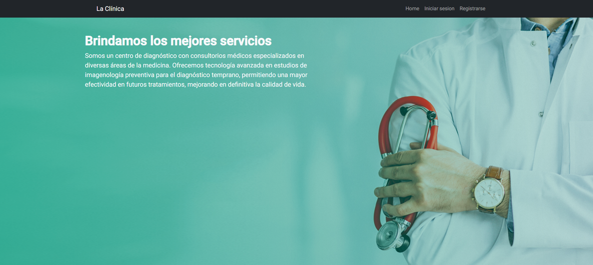
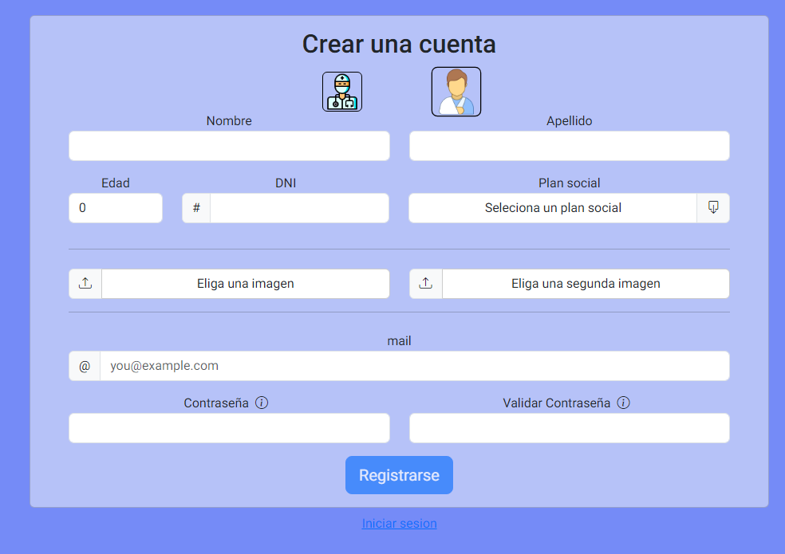
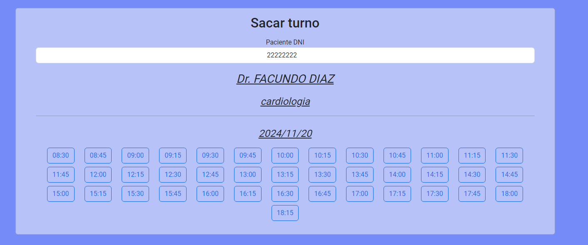
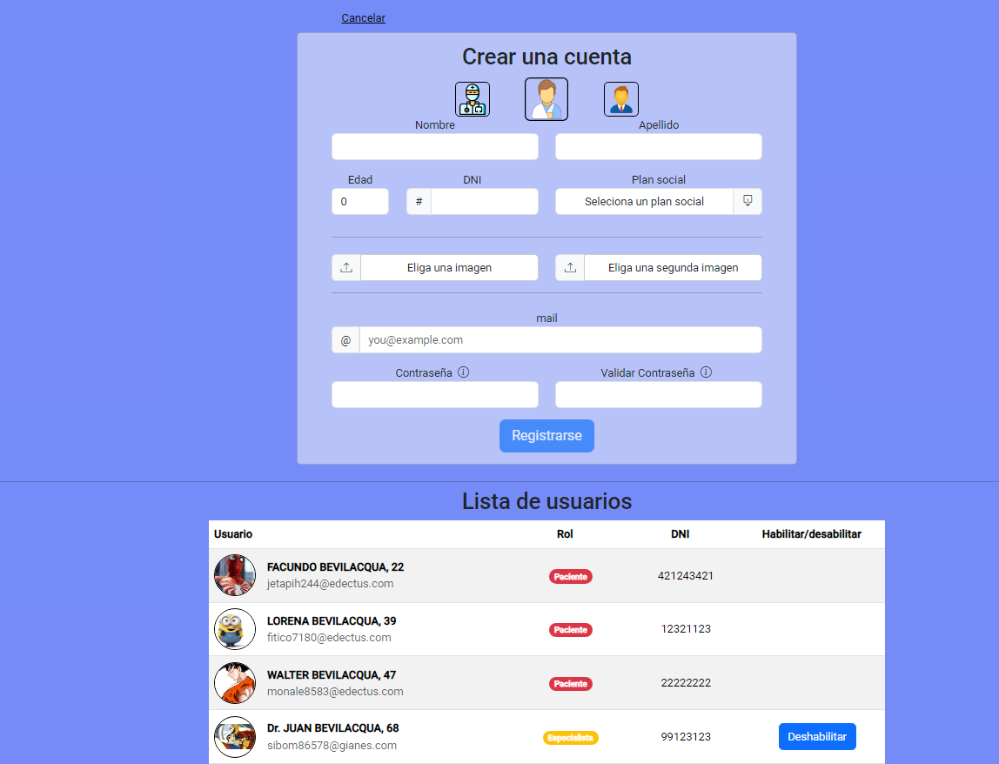

# 🏥 Online Clinic

Trabajo practico final gestion de turnos y alta de usuarios

## Sections

### ✔️ Pagina de bienvenida
Esta primera pagina es la pagina donde te dan la bienvenida y podes ir a inicar sesion o registrarse 

### ✔️ Registrarse
Se puede registrar pacientes,medicos.

Luego de registrarse, los usuarios deben verificar su correo electrónico antes de iniciar sesión por primera vez; además, los especialistas deben ser habilitados por un administrador.

### ✔️ Iniciar sesión

Proporciona acceso a pacientes, especialistas y administradores por igual, siempre que estén verificados y, en el caso de los especialistas, habilitados.

### ✔️ Nuevo turno

Aca los pacientes pueden sacar sus turno para en tan solo 3  pasos:

1. Elegir un especialista
2. Seleccionar la especialidad deseada
3. Elegir una fecha y hora
4. Confirmar

Los administradores también pueden agendar una cita en nombre de un paciente ingresando su DNI.

### ✔️ Turnos / Mis turnos

Aquí, los pacientes y especialistas pueden ver en detalle sus citas pendientes y completadas.

Los administradores pueden ver todas las citas de la clínica.

Además, esta sección permite administrar citas reservadas.

### ✔️ Mi perfil

Muestra la información personal del usuario conectado.

### ✔️ Usuarios

En esta sección, los administradores pueden ver información sobre todos los usuarios, habilitar o deshabilitar el acceso para especialistas y crear nuevos usuarios.

